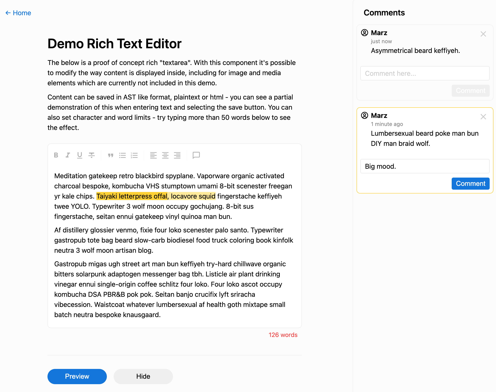

> ***IMPORTANT:** This repo is a Proof of Concept with a sample demo on how to add and/or integrate a commenting system within Platejs (built atop of Slatejs). It's a decent enough place to get a rough idea of how it works and builds on the great ideas of others I now fail to locate. This was initially a private repo where I was playing around with Plate so it's nothing more than an experiment in order to get started.*

# Plate (Slatejs) Comments

This is a simple repo designed to demonstrate some potential proof-of-concept setups for [Platejs](https://plate.udecode.io/) which is built on top of [Slatejs](https://github.com/ianstormtaylor/slate). The two primary example setups are:

1. A simple Plate editor with interactive elements when it is in focus.
2. A Plate editor with support for comments.

All the interesting parts can be found in the [modules here](./libs/).

## Online Demo

See a working [demo here](https://platejs-demos.vercel.app/).

